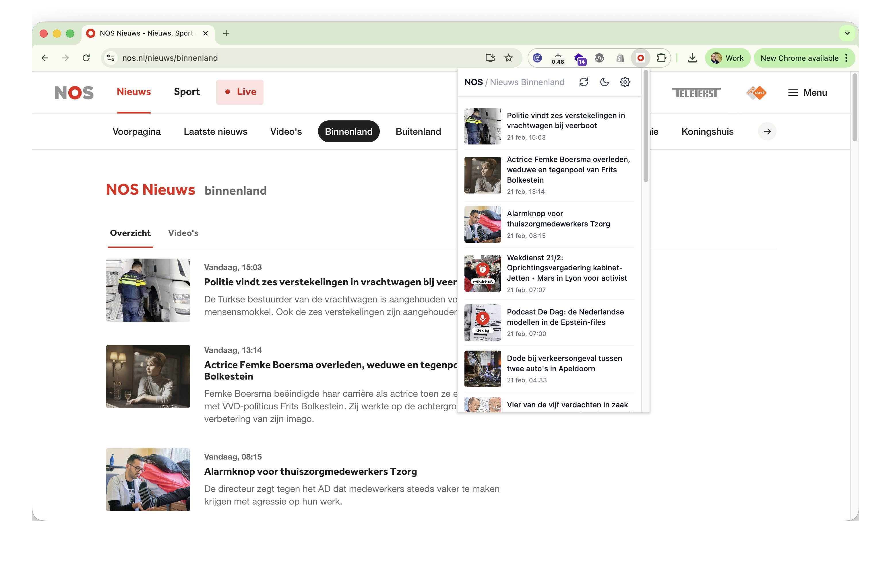
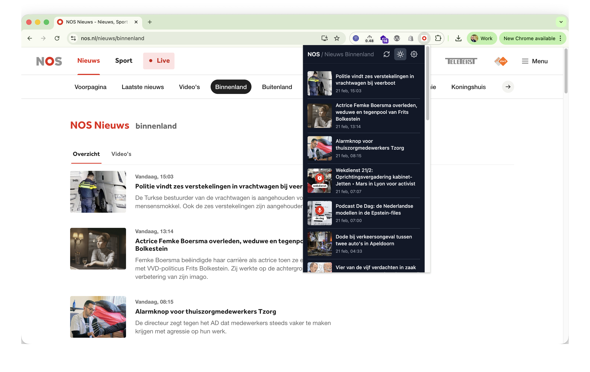
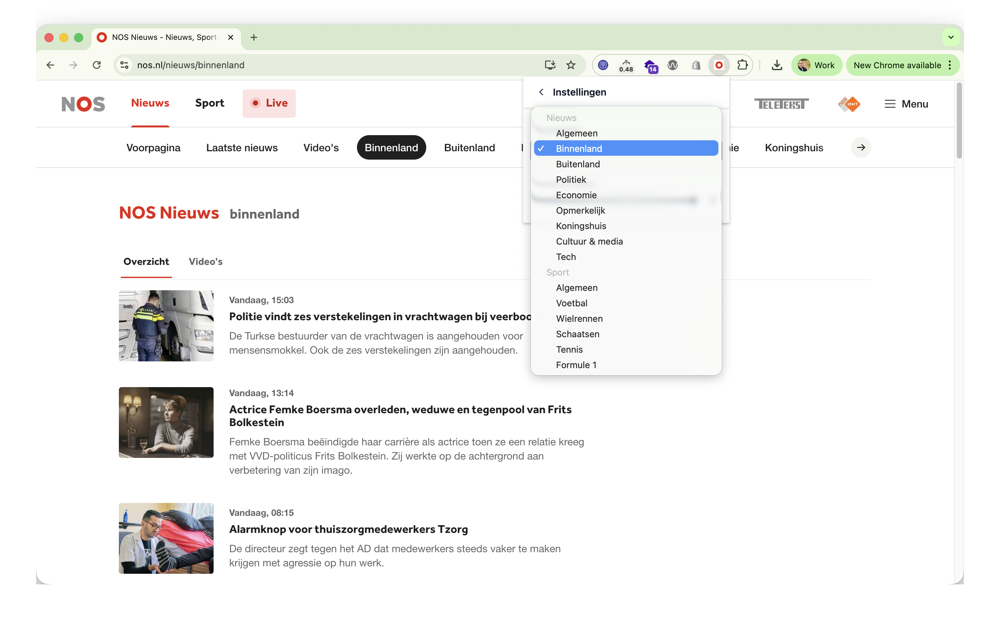

# NOS

A Chrome extension that shows the latest NOS (Dutch news) articles from the general news feed in a popup.

**Note:** This is an unofficial extension, built for AI testing purposes. It is not affiliated with or endorsed by NOS.

## Screenshots





## Features

- View recent NOS articles in the extension popup
- Fetches content from the NOS RSS feed
- Settings view for preferences
- Styled with Tailwind CSS

## Tech stack

- **Vue 3** – popup UI
- **Rollup** – build
- **Tailwind CSS 4** – styling
- **Manifest V3** – Chrome extension format

## Development

### Prerequisites

- Node.js
- pnpm (or npm/yarn)

### Install

```bash
pnpm install
```

### Build

```bash
pnpm build
```

Output is written to the `dist/` folder.

### Watch (development)

```bash
pnpm watch
```

Rebuilds on file changes.

### Load in Chrome

1. Open `chrome://extensions/`
2. Enable **Developer mode**
3. Click **Load unpacked**
4. Select the `dist/` folder

## Project structure

- `src/` – source (Vue components, manifest, background script, feed logic)
- `dist/` – built extension (load this in Chrome)

## Permissions

The extension uses:

- **Host**: `https://feeds.nos.nl/*` – to fetch the NOS news feed
- **alarms** – for periodic refresh
- **storage** – for user settings

## License

Private.
